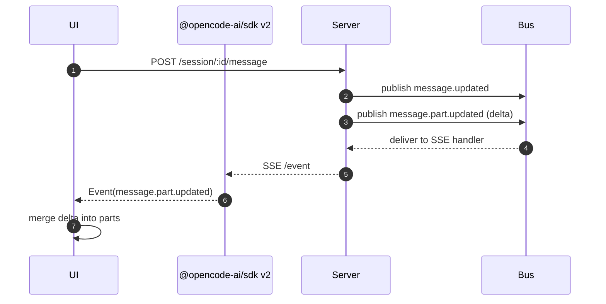
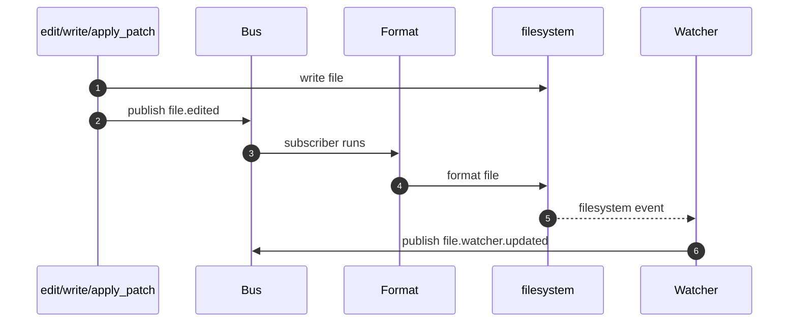

# Event Mechanism (v1.1.31)

OpenCode uses typed events to move state changes between the server, UI, workers, and plugins.
This is a hybrid overview + reference, anchored to git tag `v1.1.31`.

If you are building an integration or plugin, treat the SDK v2 `Event` union as the public contract.
If you are contributing to core, this doc also points at the internal bus and transport plumbing.

---

## Two Streams, Two Shapes

There are two primary event streams:

- Instance events: `GET /event` (scoped to a project directory)
- Global events: `GET /global/event` (fan-out across directories)

Instance events are `Event` objects:

```json
{
  "type": "message.part.updated",
  "properties": {
    "part": { "type": "text", "id": "..." },
    "delta": "..."
  }
}
```

Global events are wrapped in a directory envelope (`GlobalEvent` in SDK v2):

```json
{
  "directory": "/abs/path/to/project",
  "payload": {
    "type": "project.updated",
    "properties": { "id": "..." }
  }
}
```

---

## Public Contract vs Internals

Use the SDK v2 OpenAPI + generated types as the stable interface:

- OpenAPI source: `packages/sdk/openapi.json`
- JS SDK v2 event types: `packages/sdk/js/src/v2/gen/types.gen.ts`
- JS SDK v2 SSE methods: `packages/sdk/js/src/v2/gen/sdk.gen.ts`

Treat these as internal implementation details (useful for core contributions, avoid for external coupling):

- Event registry and union builder: `packages/opencode/src/bus/bus-event.ts`
- Instance bus (`publish`/`subscribe`/`subscribeAll`): `packages/opencode/src/bus/index.ts`
- Process-wide emitter (`GlobalBus`): `packages/opencode/src/bus/global.ts`

---

## How Events Are Defined

Feature modules define typed events using:

- `BusEvent.define("some.type", z.object(...))`

Those definitions register into a process-wide registry.
The registry can be materialized into a Zod `discriminatedUnion("type", ...)` via `BusEvent.payloads()` in `packages/opencode/src/bus/bus-event.ts`.

That union is also used in the server OpenAPI schema for SSE endpoints:

- `GET /event`: `packages/opencode/src/server/server.ts` uses `resolver(BusEvent.payloads())`
- `GET /global/event`: `packages/opencode/src/server/routes/global.ts` uses `payload: BusEvent.payloads()`

Practical implication for core contributors: if a new event is defined via `BusEvent.define(...)` and ends up in the OpenAPI schema, regenerating the SDK will include it in the `Event` union.

### Adding a new event type (core contributors)

1. Define it with `BusEvent.define("your.type", schema)` in the relevant feature module (for examples, see `packages/opencode/src/session/index.ts` and `packages/opencode/src/session/message-v2.ts`).
2. Emit it via `Bus.publish(YourEvent, properties)`.
3. Ensure the feature module is imported during server startup so the definition is registered (the registry is built at module load time).
4. Confirm the SSE OpenAPI schema includes it via `BusEvent.payloads()` wiring in `packages/opencode/src/server/server.ts`.
5. Regenerate the JS SDK so the new event is reflected in `Event` types: `./packages/sdk/js/script/build.ts`.

---

## How Events Are Published and Subscribed (Core)

The instance-scoped bus is implemented in `packages/opencode/src/bus/index.ts`:

- `Bus.publish(def, properties)`
- `Bus.subscribe(def, handler)` (exact type)
- `Bus.subscribeAll(handler)` (wildcard)

Publishing does two things:

1. Delivers to in-process subscribers for the current directory instance
2. Forwards to the process-wide `GlobalBus` as `{ directory, payload: { type, properties } }`

`GlobalBus` is a typed Node `EventEmitter` defined in `packages/opencode/src/bus/global.ts`.

---

## Transports

OpenCode uses multiple transports because not all consumers live in the same process.

### Server-Sent Events (SSE): structured bus payloads

- `GET /event` (instance events): implemented in `packages/opencode/src/server/server.ts`
- `GET /global/event` (global envelope): implemented in `packages/opencode/src/server/routes/global.ts`

The SDK v2 wraps these as async iterators (see `packages/sdk/js/src/v2/gen/sdk.gen.ts`).

Directory scoping is part of the public model: `createOpencodeClient({ directory })` sends `x-opencode-directory` (see `packages/sdk/js/src/v2/client.ts`).

### WebSocket: PTY bytes

PTY output is raw terminal output over WebSocket:

- `GET /pty/:ptyID/connect`: `packages/opencode/src/server/routes/pty.ts`

PTY lifecycle metadata still appears on the typed SSE stream (`pty.created`, `pty.updated`, `pty.exited`, `pty.deleted`), defined in `packages/opencode/src/pty/index.ts`.

### Worker/TUI IPC: internal event forwarding

When the TUI runs with a worker, instance events can be forwarded over `postMessage` RPC:

- RPC transport: `packages/opencode/src/util/rpc.ts`
- Worker side: `packages/opencode/src/cli/cmd/tui/worker.ts`
- Thread side: `packages/opencode/src/cli/cmd/tui/thread.ts`
- UI fanout: `packages/opencode/src/cli/cmd/tui/context/sdk.tsx`

This is primarily an implementation detail, but it explains why events still reach the UI even without a traditional network `EventSource`.

---

## Minimal Consumption Patterns

### Observe/log all events (SDK v2)

```ts
import { createOpencodeClient, type Event } from "@opencode-ai/sdk/v2"

const client = createOpencodeClient({
  baseUrl: "http://localhost:4096",
  directory: process.cwd(),
})

const sub = await client.event.subscribe()
for await (const event of sub.stream) {
  log(event)
}

function log(event: Event) {
  // Keep this tolerant: new events may appear over time.
  console.log(`[${event.type}]`, event.properties)
}
```

### Slack integration (plugin): notify on session.error

Plugins can observe all bus events via the `event` hook in `@opencode-ai/plugin` (`packages/plugin/src/index.ts`), wired by `packages/opencode/src/plugin/index.ts`.

Note: the runtime calls `hook.event?.({ event })` without awaiting it in `packages/opencode/src/plugin/index.ts`.
Treat the `event` hook as best-effort and make it resilient (catch errors internally, avoid long blocking work).

```ts
import type { Plugin } from "@opencode-ai/plugin"

const webhook = process.env.SLACK_WEBHOOK_URL

export const slackAlerts: Plugin = async () => {
  return {
    event: async ({ event }) => {
      if (!webhook) return
      if (event.type !== "session.error") return

      const payload = {
        text: `OpenCode session error (${event.properties.sessionID ?? "unknown"})`,
      }

      await fetch(webhook, {
        method: "POST",
        headers: { "content-type": "application/json" },
        body: JSON.stringify(payload),
      })
    },
  }
}
```

---

## Plugin Hook Triggers (Not SSE Events)

If you see strings like `experimental.chat.system.transform` in plugins, those are plugin hook names, not bus event types.
They are invoked via `Plugin.trigger("hook.name", input, output)` inside the OpenCode runtime (see `packages/opencode/src/plugin/index.ts`).
They do not show up on `GET /event` / `GET /global/event`, and they will not appear in the SDK v2 `Event` union.

### Execution model (what actually happens)

`Plugin.trigger(name, input, output)`:

- Loads all plugin hook objects for the current directory instance (plugin loading: `packages/opencode/src/plugin/index.ts`).
- Iterates hooks in load order and, for each plugin that implements `hook[name]`, awaits it: `await fn(input, output)`.
- Returns the same `output` object reference after all hooks run.

Practical implications:

- Mutation-based: most hooks expect you to mutate `output` in-place (arrays/objects).
- Sequential and awaited: slow hooks add latency to the call site.
- No isolation: errors thrown from a hook will bubble up unless the call site catches them.

Scoping: hooks are evaluated within the current project directory instance (the plugin runtime uses `Instance.state(...)` in `packages/opencode/src/plugin/index.ts`).

### Hook catalog (selected)

Hook type definitions live in `packages/plugin/src/index.ts`.
Trigger sites are in the OpenCode runtime under `packages/opencode/src/`.

#### `[Experimental]` `experimental.chat.system.transform`

- Signature: `(input: { sessionID: string }, output: { system: string[] }) => Promise<void>`
- Triggered in: `packages/opencode/src/session/llm.ts`
- When: right after OpenCode builds the `system: string[]` prompt list, before provider/model params/headers are finalized.
- Typical usage:
  - add a policy line (organization rules, safety rules)
  - inject per-project conventions
  - delete or reorder system lines (use carefully)

What is in `output.system` by default:

- element 0: header from `SystemPrompt.header(...)`
- element 1: a single string that typically contains agent prompt, provider prompt, and any per-message system additions joined with newlines

Important behavior in `packages/opencode/src/session/llm.ts`:

- If your plugin empties `output.system`, OpenCode restores the original system prompt list.
- OpenCode tries to maintain a 2-part system structure for caching: if you keep the first line (header) unchanged and produce more than 2 system entries, it rejoins entries 2..N into a single string.

Example:

```ts
import type { Plugin } from "@opencode-ai/plugin"

export const systemTweaks: Plugin = async () => {
  return {
    "experimental.chat.system.transform": async (input, output) => {
      output.system.push(`Session: ${input.sessionID}`)
      output.system.push("Follow our internal engineering standards.")
    },
  }
}
```

#### `[Experimental]` `experimental.chat.messages.transform`

- Signature: `(input: {}, output: { messages: { info: Message; parts: Part[] }[] }) => Promise<void>`
- Triggered in: `packages/opencode/src/session/prompt.ts`
- When: after OpenCode prepares the message history for the next model call (including any ephemeral reminders), before it is converted to provider `ModelMessage[]`.
- Typical usage:
  - redact or rewrite historical messages
  - drop synthetic parts from the model context
  - inject additional context messages

Caveat: this hook mutates the in-memory copy used for the model call; it is not automatically persisted to storage.
Also note the plugin hook types come from `@opencode-ai/sdk` (`packages/plugin/src/index.ts`), while the runtime value is built from internal `MessageV2` structures; write defensive code and avoid relying on undocumented fields.

#### `[Stable]` `chat.params`

- Signature: `(input: { sessionID; agent; model; provider; message }, output: { temperature; topP; topK; options }) => Promise<void>`
- Triggered in: `packages/opencode/src/session/llm.ts`
- When: after base provider options are assembled and merged with agent/model/variant options, before the model stream begins.
- Typical usage:
  - tune sampling parameters (temperature/topP/topK)
  - add provider-specific options in `output.options`

#### `[Stable]` `chat.headers`

- Signature: `(input: { sessionID; agent; model; provider; message }, output: { headers }) => Promise<void>`
- Triggered in: `packages/opencode/src/session/llm.ts`
- When: after parameters are prepared, before sending the request.
- Typical usage:
  - set custom headers for a provider gateway
  - inject additional correlation identifiers

#### `[Stable]` `chat.message`

- Signature: `(input: { sessionID; agent?; model?; messageID?; variant? }, output: { message: UserMessage; parts: Part[] }) => Promise<void>`
- Triggered in: `packages/opencode/src/session/prompt.ts`
- When: after OpenCode has assembled the user message + parts for this turn, but before saving message/parts.
- Typical usage:
  - normalize or rewrite user text parts
  - attach metadata parts
  - reject or sanitize certain user inputs (by rewriting parts)

#### `[Stable]` `permission.ask`

- Signature: `(input: Permission, output: { status: "ask" | "deny" | "allow" }) => Promise<void>`
- Triggered in: `packages/opencode/src/permission/index.ts`
- When: when a permission request is about to be shown to the user.
- Typical usage:
  - auto-allow safe permissions under certain patterns
  - auto-deny based on policy

#### `[Stable]` `command.execute.before`

- Signature: `(input: { command; sessionID; arguments }, output: { parts: Part[] }) => Promise<void>`
- Triggered in: `packages/opencode/src/session/prompt.ts`
- Typical usage:
  - add synthetic parts (context) before running a command
  - log or block certain commands by side effects (there is no explicit deny field in the hook output)

#### `[Stable]` `tool.execute.before` / `tool.execute.after`

- Signatures:
  - `tool.execute.before`: `(input: { tool; sessionID; callID }, output: { args: any }) => Promise<void>`
  - `tool.execute.after`: `(input: { tool; sessionID; callID }, output: { title; output; metadata }) => Promise<void>`
- Triggered in: tool execution pipeline in `packages/opencode/src/session/prompt.ts`
- Typical usage:
  - rewrite tool args
  - redact tool output or attach metadata

Caveat: some call sites pass whatever the tool returned as the `output` argument for `tool.execute.after`.
Be defensive if you implement this hook (null checks, default values).

#### `[Experimental]` `experimental.session.compacting`

- Signature: `(input: { sessionID }, output: { context: string[]; prompt?: string }) => Promise<void>`
- Triggered in: `packages/opencode/src/session/compaction.ts`
- When: right before the compaction prompt is assembled.
- Typical usage:
  - append extra context strings
  - replace the compaction prompt entirely

#### `[Experimental]` `experimental.text.complete`

- Signature: `(input: { sessionID; messageID; partID }, output: { text: string }) => Promise<void>`
- Triggered in: `packages/opencode/src/session/processor.ts`
- When: after an assistant text part finishes streaming, before final storage.
- Typical usage:
  - redact secrets
  - rewrite output formatting

### Versioning note

The plugin package currently types hooks against `@opencode-ai/sdk` (not `@opencode-ai/sdk/v2`) in `packages/plugin/src/index.ts`.
Treat hook input/output shapes as potentially drifting across versions and prefer defensive code (feature detection, defaults).

---

## Two Core Flows (Diagrams)

### Session prompt -> streamed deltas -> UI



### File edit -> file.edited -> formatter -> watcher

`file.edited` is emitted by tools like edit/write/apply_patch, then formatting can subscribe to it (`packages/opencode/src/format/index.ts`).
File watcher notifications can result in `file.watcher.updated` (`packages/opencode/src/file/watcher.ts`).



---

## Event Reference (SDK v2)

Badges:

- `[Stable]` reasonable for external consumers to rely on
- `[Experimental]` may change semantics/frequency
- `[Internal]` exposed but primarily for OpenCode runtime/UI
- `[Deprecated]` kept for compatibility; avoid depending on it

Source of truth for this list: `export type Event = ...` in `packages/sdk/js/src/v2/gen/types.gen.ts`.

| Type                            | Stability      | `properties` shape (high-level)             | Defined in                                    |
| ------------------------------- | -------------- | ------------------------------------------- | --------------------------------------------- |
| `installation.updated`          | [Stable]       | `{ version }`                               | `packages/opencode/src/installation/index.ts` |
| `installation.update-available` | [Stable]       | `{ version }`                               | `packages/opencode/src/installation/index.ts` |
| `project.updated`               | [Stable]       | `Project`                                   | `packages/opencode/src/project/project.ts`    |
| `server.instance.disposed`      | [Internal]     | `{ directory }`                             | `packages/opencode/src/bus/index.ts`          |
| `server.connected`              | [Stable]       | `{ [key: string]: unknown }`                | `packages/opencode/src/server/event.ts`       |
| `global.disposed`               | [Stable]       | `{ [key: string]: unknown }`                | `packages/opencode/src/server/event.ts`       |
| `lsp.client.diagnostics`        | [Experimental] | `{ serverID, path }`                        | `packages/opencode/src/lsp/client.ts`         |
| `lsp.updated`                   | [Experimental] | `{ [key: string]: unknown }`                | `packages/opencode/src/lsp/index.ts`          |
| `file.edited`                   | [Stable]       | `{ file }`                                  | `packages/opencode/src/file/index.ts`         |
| `message.updated`               | [Stable]       | `{ info: Message }`                         | `packages/opencode/src/session/message-v2.ts` |
| `message.removed`               | [Stable]       | `{ sessionID, messageID }`                  | `packages/opencode/src/session/message-v2.ts` |
| `message.part.updated`          | [Stable]       | `{ part: Part, delta? }`                    | `packages/opencode/src/session/message-v2.ts` |
| `message.part.removed`          | [Stable]       | `{ sessionID, messageID, partID }`          | `packages/opencode/src/session/message-v2.ts` |
| `permission.asked`              | [Stable]       | `PermissionRequest`                         | `packages/opencode/src/permission/next.ts`    |
| `permission.replied`            | [Stable]       | `{ sessionID, requestID, reply }`           | `packages/opencode/src/permission/next.ts`    |
| `session.status`                | [Stable]       | `{ sessionID, status }`                     | `packages/opencode/src/session/status.ts`     |
| `session.idle`                  | [Deprecated]   | `{ sessionID }`                             | `packages/opencode/src/session/status.ts`     |
| `question.asked`                | [Stable]       | `QuestionRequest`                           | `packages/opencode/src/question/index.ts`     |
| `question.replied`              | [Stable]       | `{ sessionID, requestID, answers }`         | `packages/opencode/src/question/index.ts`     |
| `question.rejected`             | [Stable]       | `{ sessionID, requestID }`                  | `packages/opencode/src/question/index.ts`     |
| `session.compacted`             | [Experimental] | `{ sessionID }`                             | `packages/opencode/src/session/compaction.ts` |
| `todo.updated`                  | [Experimental] | `{ sessionID, todos }`                      | `packages/opencode/src/session/todo.ts`       |
| `file.watcher.updated`          | [Experimental] | `{ file, event }`                           | `packages/opencode/src/file/watcher.ts`       |
| `tui.prompt.append`             | [Internal]     | `{ text }`                                  | `packages/opencode/src/cli/cmd/tui/event.ts`  |
| `tui.command.execute`           | [Internal]     | `{ command }`                               | `packages/opencode/src/cli/cmd/tui/event.ts`  |
| `tui.toast.show`                | [Internal]     | `{ title?, message, variant, duration? }`   | `packages/opencode/src/cli/cmd/tui/event.ts`  |
| `tui.session.select`            | [Internal]     | `{ sessionID }`                             | `packages/opencode/src/cli/cmd/tui/event.ts`  |
| `mcp.tools.changed`             | [Experimental] | `{ server }`                                | `packages/opencode/src/mcp/index.ts`          |
| `mcp.browser.open.failed`       | [Experimental] | `{ mcpName, url }`                          | `packages/opencode/src/mcp/index.ts`          |
| `command.executed`              | [Internal]     | `{ name, sessionID, arguments, messageID }` | `packages/opencode/src/command/index.ts`      |
| `session.created`               | [Stable]       | `{ info: Session }`                         | `packages/opencode/src/session/index.ts`      |
| `session.updated`               | [Stable]       | `{ info: Session }`                         | `packages/opencode/src/session/index.ts`      |
| `session.deleted`               | [Stable]       | `{ info: Session }`                         | `packages/opencode/src/session/index.ts`      |
| `session.diff`                  | [Experimental] | `{ sessionID, diff }`                       | `packages/opencode/src/session/index.ts`      |
| `session.error`                 | [Stable]       | `{ sessionID?, error? }`                    | `packages/opencode/src/session/index.ts`      |
| `vcs.branch.updated`            | [Experimental] | `{ branch? }`                               | `packages/opencode/src/project/vcs.ts`        |
| `pty.created`                   | [Experimental] | `{ info: Pty }`                             | `packages/opencode/src/pty/index.ts`          |
| `pty.updated`                   | [Experimental] | `{ info: Pty }`                             | `packages/opencode/src/pty/index.ts`          |
| `pty.exited`                    | [Experimental] | `{ id, exitCode }`                          | `packages/opencode/src/pty/index.ts`          |
| `pty.deleted`                   | [Experimental] | `{ id }`                                    | `packages/opencode/src/pty/index.ts`          |

---

## Caveats You Should Handle

- `server.heartbeat` is written onto the `GET /event` SSE stream in `packages/opencode/src/server/server.ts`, but it is not part of the SDK v2 `Event` union; treat it as `[Internal]` and ignore unknown types when consuming raw SSE.
- The first message on `GET /global/event` is written in `packages/opencode/src/server/routes/global.ts` and may omit `directory`; if you consume the global stream directly, be tolerant of this initial payload.
